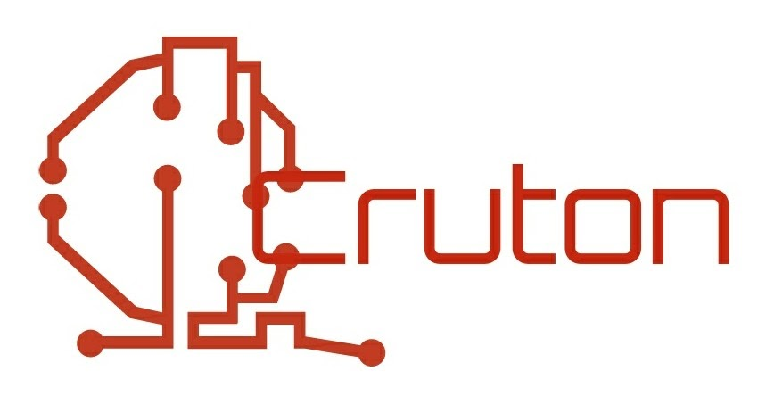

## This is a *POC* and not currently production ready. Your mileage may vary.

----

### Rebaked environmental device management system

Environmental inventory(device) management system built for hundreds of entities, thousands environments, and millions of devices.
<!-- TOC -->

- [Rebaked environmental device management system](#rebaked-environmental-device-management-system)
    - [Quick getting started development guide](#quick-getting-started-development-guide)
        - [Build a cruton container](#build-a-cruton-container)
        - [Start cruton and cassandra](#start-cruton-and-cassandra)
        - [Create **keyspace** where the tables will be created.](#create-keyspace-where-the-tables-will-be-created)
        - [Sync the tables](#sync-the-tables)
    - [Working with the API.](#working-with-the-api)
        - [Discovery](#discovery)
        - [Entities](#entities)
            - [HEAD all entities](#head-all-entities)
            - [PUT an entity](#put-an-entity)
            - [HEAD an entities](#head-an-entities)
            - [POST one or many entities (bulk import)](#post-one-or-many-entities-bulk-import)
            - [GET entities](#get-entities)
            - [GET entities and search](#get-entities-and-search)
            - [GET entities and search doing a partial match using provided criteria](#get-entities-and-search-doing-a-partial-match-using-provided-criteria)
        - [Environments](#environments)
            - [HEAD all environments](#head-all-environments)
            - [PUT an environment](#put-an-environment)
            - [HEAD an environment](#head-an-environment)
            - [POST one or many environments (bulk import)](#post-one-or-many-environments-bulk-import)
            - [GET environments](#get-environments)
            - [GET environments and search](#get-environments-and-search)
            - [GET environments and search doing a partial match using provided criteria](#get-environments-and-search-doing-a-partial-match-using-provided-criteria)
        - [Devices](#devices)
            - [HEAD all devices](#head-all-devices)
            - [PUT a device](#put-a-device)
            - [HEAD a device](#head-a-device)
            - [POST one or many devices (bulk import)](#post-one-or-many-devices-bulk-import)
            - [GET devices](#get-devices)
            - [GET devices and search](#get-devices-and-search)
            - [GET devices and search doing a partial matching using provided criteria](#get-devices-and-search-doing-a-partial-matching-using-provided-criteria)
            - [GET an IPXE return for a specific device](#get-an-ipxe-return-for-a-specific-device)
    - [Utilities](#utilities)
        - [Synchronizing the table space with the backend store.](#synchronizing-the-table-space-with-the-backend-store)

<!-- /TOC -->

----
## Quick getting started development guide

The following guide will result in a running cruton application.

Requirements:
 * docker
 * docker-compose

### Build a cruton container
```
docker-compose build
```

### Start cruton and cassandra
```
docker-compose up
```

### Create **keyspace** where the tables will be created.
This setup creates a basic cassandra container with no authentication needed. So we don't need to create a user with a password. We do howerver need to createa keyspace.
``` bash
docker exec -ti cassandra_cruton cqlsh localhost -e "CREATE KEYSPACE IF NOT EXISTS "cruton" WITH REPLICATION = {'class': 'NetworkTopologyStrategy', 'datacenter1': 1};"
```

### Sync the tables
```
docker exec -ti  cruton_cruton_1 cruton-manage --config-file /etc/cruton/cruton.ini sync_tables
```

----

## Working with the API.

To start the API it's recommended that you run the service behind a webserver like NGINX, Apache, using uWSGI, etc.
The typical API process can be envoked by running the ``cruton-api-wsgi --config-file /etc/cruton/cruton.ini`` command.
If you need or want to run the API in debug mode you can do so by invoking the ``cruton-api-debug --config-file /etc/cruton/cruton.ini``
command.


### Discovery
```bash
curl 'http://127.0.0.1:5150/dicovery'
```
The API endpoints and all available actions are discoverable. The dicovery endpoint allows the a user or an
application to discover all available actions for all available versions.

### Entities

##### HEAD all entities
```
curl --head 'http://127.0.0.1:5150/v1/entities'
```

##### PUT an entity
``` bash
curl -H 'Content-Type: application/json' -D - -XPUT 'http://127.0.0.1:5150/v1/entities/Solo1' -d '{"name": "TestEntitySolo"}'
```

##### HEAD an entities
```
curl --head 'http://127.0.0.1:5150/v1/entities/Solo1'
```

##### POST one or many entities (bulk import)
``` bash
curl -H 'Content-Type: application/json'  -D - -XPOST 'http://127.0.0.1:5150/v1/entities' -d '[{"ent_id": "Ent1", "tags": ["TestEntityTagOne"], "contacts": {"person1": "4155551212", "person2": "email@person2.example.com"}, "name": "TestEntityOne"}, {"ent_id": "Ent2", "tags": ["TestEntityTagOne", "TestEntityTagTwo"], "contacts": {"person2": "email@person2.example.com"}, "name": "TestEntityTwo"}]'
```

##### GET entities
``` bash
curl 'http://127.0.0.1:5150/v1/entities'
````

##### GET entities and search
``` bash
curl -D - 'http://127.0.0.1:5150/v1/entities?contact=person1'
```

##### GET entities and search doing a partial match using provided criteria
``` bash
curl -D - 'http://127.0.0.1:5150/v1/entities?name=EntityTag&fuzzy=true'
```
You should be aware that **ANY** field in the data module can be part of the search criteria.


### Environments

##### HEAD all environments
``` bash
# HEAD environments root
curl --head 'http://127.0.0.1:5150/v1/entities/Ent1/environments'
```

##### PUT an environment
``` bash
curl -H 'Content-Type: application/json' -D - -XPUT 'http://127.0.0.1:5150/v1/entities/Solo1/environments/SoloEnv1' -d '{"name": "SoloEnvironmentOne"}'
```

##### HEAD an environment
``` bash
# HEAD environments root
curl --head 'http://127.0.0.1:5150/v1/entities/Ent1/environments/SoloEnv1'
```

##### POST one or many environments (bulk import)
``` bash
curl -H 'Content-Type: application/json' -D - -XPOST 'http://127.0.0.1:5150/v1/entities/Ent1/environments' -d '[{"env_id": "Env1", "tags": ["TestEnvironmentTagOne"], "contacts": {"person1": "4155551212", "person2": "email@person2.example.com"}, "name": "TestEnvironmentOne"}, {"env_id": "Env2", "tags": ["TestEnvironmentTagOne", "TestEnvironmentTagTwo"], "contacts": {"person1": "4155551212"}, "name": "TestEnvironmentTwo"}]'
```

##### GET environments
``` bash
curl -D - 'http://127.0.0.1:5150/v1/entities/x/environments/Env2'
```

##### GET environments and search
``` bash
curl -D - 'http://127.0.0.1:5150/v1/entities/x/environments?contact=person1'
```

##### GET environments and search doing a partial match using provided criteria
``` bash
curl -D - 'http://127.0.0.1:5150/v1/entities/x/environments?tag=EnvironmentTag&fuzzy=true'
```
You should be aware that **ANY** field in the data module can be part of the search criteria.


## Devices

##### HEAD all devices
``` bash
curl --head http://127.0.0.1:5150/v1/entities/Solo1/environments/SoloEnv1/devices
```

##### PUT a device
``` bash
curl -H 'Content-Type: application/json' -D - -XPUT 'http://127.0.0.1:5150/v1/entities/Solo1/environments/SoloEnv1/devices/SoloDev1' -d '{"name": "SoloDeviceOne"}'
```

##### HEAD a device
``` bash
curl --head http://127.0.0.1:5150/v1/entities/Solo1/environments/SoloEnv1/devices/SoloDev1
```

##### POST one or many devices (bulk import)
``` bash
curl -H 'Content-Type: application/json' -D - -XPOST 'http://127.0.0.1:5150/v1/entities/Solo1/environments/SoloEnv1/devices' -d '[{"dev_id": "Dev1", "tags": ["TestEnvironmentTagOne"], "access_ip": {"drac": "172.16.24.1", "mgmt": "fe80::6656:fc1d:cd1:ddba"}, "rack_id": "TestRack1", "row_id": "TestRow1", "name": "TestDeviceOne"}, {"dev_id": "Dev2", "tags": ["TestDeviceTagOne", "TestDeviceTagTwo"], "access_ip": {"drac": "172.16.24.2", "mgmt": "fe80::6656:fc1d:cd1:ddbb"}, "rack_id": "TestRack2", "row_id": "TestRow1", "name": "TestDeviceTwo"}]'
```

##### GET devices
``` bash
curl 'http://127.0.0.1:5150/v1/entities/Solo1/environments/SoloEnv1/devices'
```

##### GET devices and search
``` bash
curl 'http://127.0.0.1:5150/v1/entities/Solo1/environments/SoloEnv1/devices?row_id=TestRow1'
```

##### GET devices and search doing a partial matching using provided criteria
``` bash
curl 'http://127.0.0.1:5150/v1/entities/Solo1/environments/SoloEnv1/devices?name=Test&fuzzy=true'
```
You should be aware that **ANY** field in the data module can be part of the search criteria.

##### GET an IPXE return for a specific device
``` bash
curl 'http://127.0.0.1:5150/v1/entities/TestEntity1/environments/TestEnvironment1A/devices/TestDevice1A/ipxe"
```

If a device has an has variable with "ipxe_" as the prefix the ipxe endpoint will return an ipxe config using those variables.

----

## Utilities

Automated data population can be simply done using an Ansible playbook. [More on helpful playbooks can be found here](playbooks/README.md)

### Synchronizing the table space with the backend store.

``` bash
cruton-manage --config-file /etc/cruton/cruton.ini sync_tables
```

----
Additional documentation:

  * [Data Model](docs/data-model.md)
  * [Installation](docs/installation.md)
  * [Cassandra](docs/cassandra.md)
